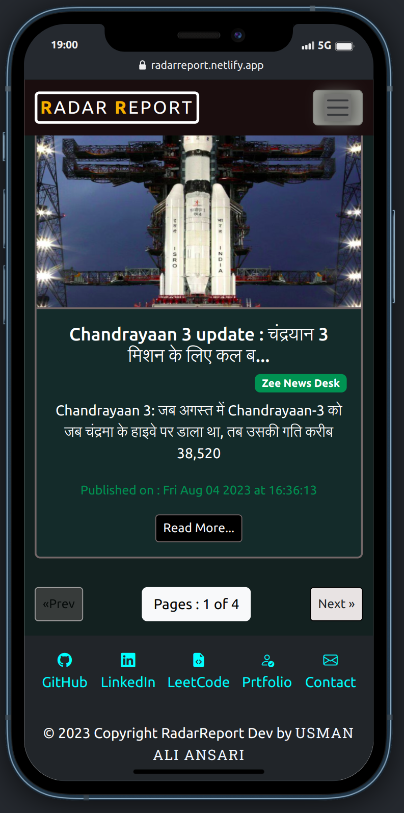

# About Radar Report

## _Radar Report_
A Radar Report is a concise and attention-grabbing summary of the main point or subject of a news story. It serves as the title of the news article or Headlines and Description with multiple info. 

## _Concise Summary: Radar Report_
 Radar Report News headlines aim to encapsulate the essence of a news story in just a few words. They provide a quick overview of what the news article is about.

## _Engagement:_
 Headlines are designed to capture the reader's attention and entice them to read the full article. A compelling headline can significantly influence whether a reader chooses to click on and read the story.

## _Key Information:_ 
Headlines often include important details such as the subject, main event, location, and time of the news story. They convey the most relevant information to the reader at a glance.

# Features for Client(Reader)

- Multiple Langugae Support
- Multiple Country Support
- Multiple Category Support
- Responsive for Mobile Viewer also
- Various Features are comming soon...
# Some Screenshorts
- Desktop/laptop view

- Mobile/tab view
